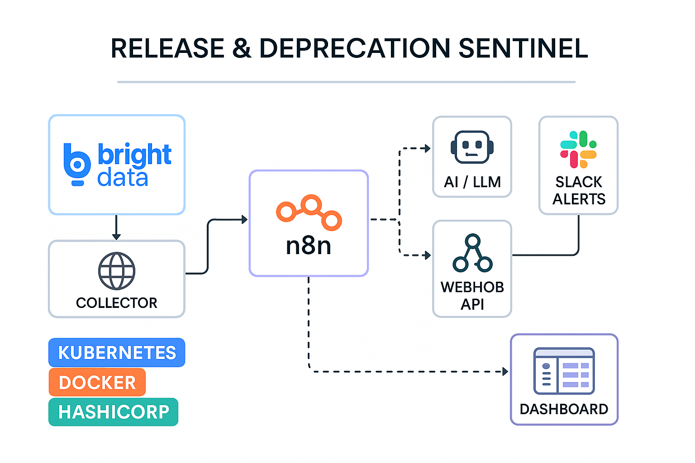

# Release & Deprecation Sentinel 🚦

**Autonomous SRE Copilot with Bright Data + n8n**

## 📌 Overview
Keeping track of Kubernetes, Docker, HashiCorp, Elastic, and dozens of vendor updates is overwhelming.  
Missed deprecations can cause outages.  
Release & Deprecation Sentinel automates vendor monitoring with **Bright Data** and **n8n**.

## 🎯 Features
- Automated vendor release/deprecation fetching (18+ vendors).
- Bright Data proxy integration for reliable fetching.
- Normalize + deduplicate vendor data.
- Ownership mapping and severity classification.
- Slack alerts for deprecations/releases.
- Webhook API + simple HTML dashboard.

## 🛠 Architecture

## Workflow

## 🚀 Quick Start
1. Import workflow from `workflows/n8nworkflow.json` into your n8n cloud instance.
2. Configure:
   - Bright Data proxy credentials.
   - Slack webhook URL.
3. Run manually or set up Scheduler (6h default).
4. Visit the webhook endpoint or `ui/index.html` for the dashboard.

## 📊 Example Slack Alert
[LOW] Elastic Kibana release unknown
Impact:
Owner: Unassigned • Due: 2025-10-19
Release notes
